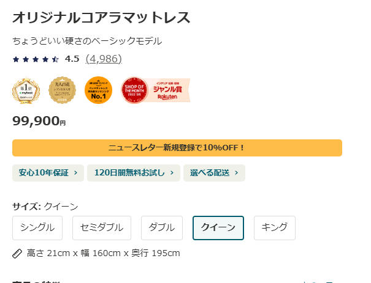
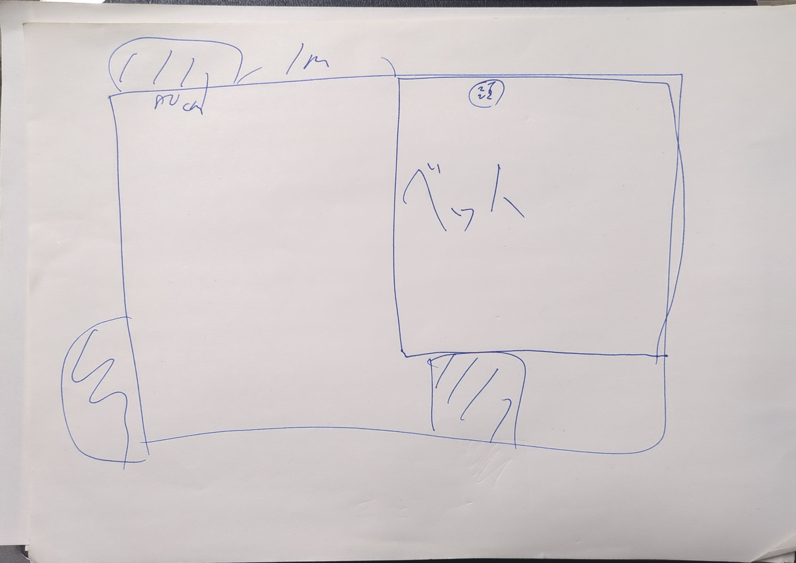
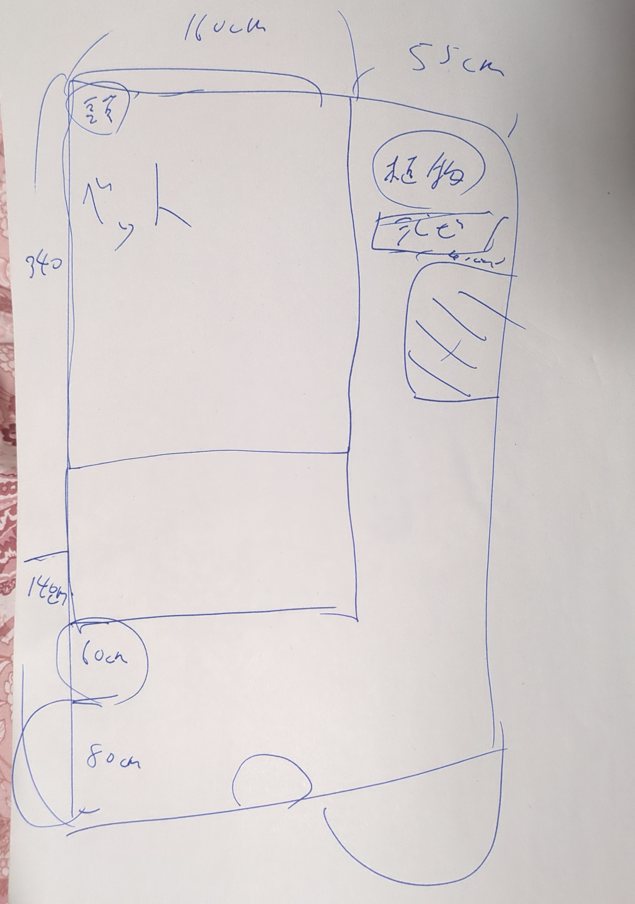

# 同棲ベット

## ニトリ

- **シングルのフレーム**: 29,000 円
- **セミダブルのフレーム**: 36,000 円
- **シングルのマット**: 29,990 円
- **セミダブルのマット**: 39,990 円
- **合体させるもの**: 24,990 円

### 合計: 159,970 円

## コアラ

### **1. オリジナルコアラマットレス (Original Koala Mattress)**

| サイズ     | 幅 (cm) | 長さ (cm) | 価格（税込） |
| ---------- | ------- | --------- | ------------ |
| シングル   | 97      | 195       | ¥69,900      |
| セミダブル | 120     | 195       | ¥79,900      |
| ダブル     | 140     | 195       | ¥89,900      |
| クイーン   | 160     | 195       | ¥99,900      |
| キング     | 180     | 195       | ¥119,900     |

---

### **2. コアラマットレスプラス (PLUS)**

| サイズ     | 幅 (cm) | 長さ (cm) | 価格（税込） |
| ---------- | ------- | --------- | ------------ |
| シングル   | 97      | 195       | ¥99,900      |
| セミダブル | 120     | 195       | ¥119,900     |
| ダブル     | 140     | 195       | ¥139,900     |
| クイーン   | 160     | 195       | ¥159,900     |

### **3. コアラマットレスシュプリーム (SUPREME)**

| サイズ     | 幅 (cm) | 長さ (cm) | 価格（税込） |
| ---------- | ------- | --------- | ------------ |
| シングル   | 97      | 195       | ¥149,900     |
| セミダブル | 120     | 195       | ¥179,900     |
| ダブル     | 140     | 195       | ¥209,900     |
| クイーン   | 160     | 195       | ¥239,900     |

## ベットサイズについて

| ベッドサイズ               | 幅 (cm) | 長さ (cm) | 主な用途/特徴                                  |
| -------------------------- | ------- | --------- | ---------------------------------------------- |
| シングル (Single)          | 約 97   | 約 195    | 一人用で最も一般的なサイズ。狭い部屋に最適。   |
| セミダブル (Semi-Double)   | 約 120  | 約 195    | 一人でゆったり寝たい場合に適している。         |
| ダブル (Double)            | 約 140  | 約 195    | カップル用のスタンダードサイズ。               |
| ワイドダブル (Wide Double) | 約 150  | 約 195    | ダブルより広く、二人で快適に寝たい場合に最適。 |
| クイーン (Queen)           | 約 160  | 約 195    | 二人用としてゆったりとした広さを確保。         |
| キング (King)              | 約 180  | 約 195    | カップルや小さい子供と一緒に寝る場合に便利。   |
| ワイドキング (Wide King)   | 約 200  | 約 195    | 家族全員で寝る場合に最適な最大級の広さ。       |

### **1. 寸法の違い**

| サイズ   | 幅 (cm) | 長さ (cm) | 面積差    |
| -------- | ------- | --------- | --------- |
| クイーン | 160     | 195       | 約 3.12㎡ |
| キング   | 180     | 195       | 約 3.51㎡ |

**違い**: キングサイズはクイーンサイズより**幅が 20cm 広い**です。

---

### **3. 部屋の広さとの関係**

| サイズ   | 推奨寝室面積（目安） |
| -------- | -------------------- |
| クイーン | 8 畳～ 10 畳         |
| キング   | 10 畳以上            |

### クイーンサイズベッド

- **サイズ**: 幅約 160cm × 長さ 195cm
- **推奨寝室面積**: 一般的には 6 畳（約 10㎡）の部屋に設置可能とされています。

### キングサイズベッド

- **サイズ**: 幅約 180cm × 長さ 195cm
- **推奨寝室面積**: 具体的な推奨面積に関する情報は見つかりませんでしたが、クイーンサイズよりも幅が 20cm 広いため、6 畳の部屋でも設置は可能ですが、より快適な空間を確保するためには 8 畳（約 13㎡）以上の広さが望ましいと考えられます。

## マットレス決定

[コアラマットレス（クイーン）](https://koala.com/ja-jp/mattresses/original-mattress?size=queen)

高さ 21cm x 幅 160cm x 奥行 195cm

## フレームどうする？

[すのこベッド クイーン 木製ベッド フレームのみ ベッドフレーム ローベッド 高さ調整 組立簡単 ヘッドレス 一人暮らし 北欧 低ホルムアルデヒド バノン【AR】](https://www.i-office1.net/shop/36112578/?utm_source=google&utm_medium=cpc&utm_campaign=PmaxBanon&gad_source=1&gclid=CjwKCAiAyJS7BhBiEiwAyS9uNRARPf6uFh3jsuSzXUBYycbO7E7MZJizAqxeJJ5r-OLiQ6nbQurbBRoCUsUQAvD_BwE)

[SLATTUM スラットゥム ファブリックベッドフレーム, ヴィースレ ダークグレー, 160x200 cm](https://www.ikea.com/jp/ja/p/slattum-upholstered-bed-frame-vissle-dark-grey-60571247/)  
　 → ネックは、200cm

[【大型商品送料無料】 簡単に組み替えができるパレット風ベッド](https://www.bellemaison.jp/shop/commodity/0000/1240673)

[三つ折りすのこマット すのこベッド クイーン すのこマット単品のみ 木製 桐 二分割可能 完成品 低ホルムアルデヒド 布団が干せる](https://www.i-office1.net/shop/14013222/?utm_source=google&utm_medium=cpc&utm_campaign=Pmax&gad_source=1&gclid=CjwKCAiAyJS7BhBiEiwAyS9uNfunxf04JcvGx7_3mGe2Z-xl8uqvhO9osedeMc85yGnV-2TT7ru6-BoC364QAvD_BwE)

[高さ調整可能 天然木すのこベッド 『NOORA ノーラ』 連結サイズ ブラウン](https://rasik.style/products/214620-br?variant=43018179805283&utm_medium=free_pla&utm_source=google&utm_campaign=free_pla&utm_content=2609015&utm_source=google&utm_medium=cpc&utm_content=556870799975&utm_term=&utm_campaign=google_shopping_focus_rasik&utm_id=15093447500&gad_source=1&gclid=CjwKCAiAyJS7BhBiEiwAyS9uNW_UjL7lkU49rZd_ZIL8gT7SNyvJmf14ALhDpT9bk0CNfxwX5qFCmxoCZ-sQAvD_BwE)  
　 → 連結だからナシ。

[[クイーン] 北欧パイン すのこベッド ベッドフレーム 単品 3 段階高さ調節 天然木 〔49600865〕](https://www.tansu-gen.jp/products/49600865?gad_source=1&gclid=CjwKCAiAyJS7BhBiEiwAyS9uNWb4q3U6iwypLcvYKnmdw8gTrbTfgUhWCOTf3w2y1kZwtFcVIophNBoCAlwQAvD_BwE)  
　 → 耐荷重が 200kg は心もとないからナシ。

[フェリシア すのこベッド クイーンロング フレームのみ 木製 ローベッド 天然木 ロング パイン材 |ナチュラル ホワイト ブラウン 棚](https://www.i-office1.net/shop/36113208/?utm_source=google&utm_medium=cpc&utm_campaign=Pmax&gad_source=1&gclid=CjwKCAiAyJS7BhBiEiwAyS9uNRLpLqXOFTeaIqJjsIN83GFm0-vJfcQv5_P6Yp_MyN8h_6MmwSRaERoCbGEQAvD_BwE)

[レスター ローベッド クイーン フレームのみ 木製 棚付き LED 照明 コンセント すのこ ブラック ホワイト | すのこベッド ベッド](https://www.i-office1.net/shop/36112754/)

## ベットフレーム決定

[レスター ローベッド クイーン フレームのみ 木製 棚付き LED 照明 コンセント すのこ ブラック ホワイト | すのこベッド ベッド](https://www.i-office1.net/shop/36112754/)

## 部屋配置

.jpg>)
_間取図_

_ベット置き方 1_

_ベット置き方 2_
